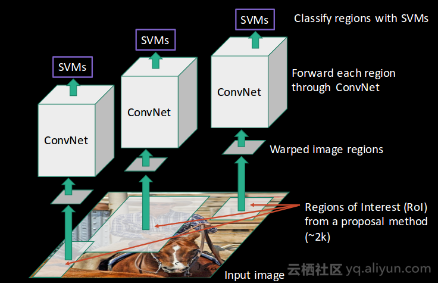
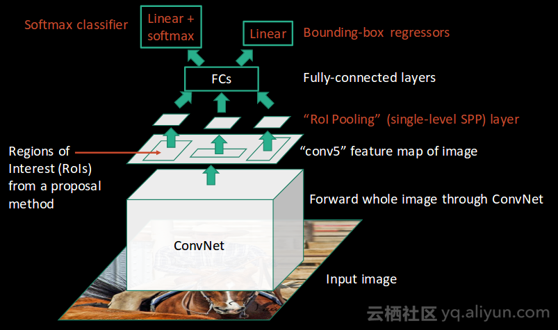
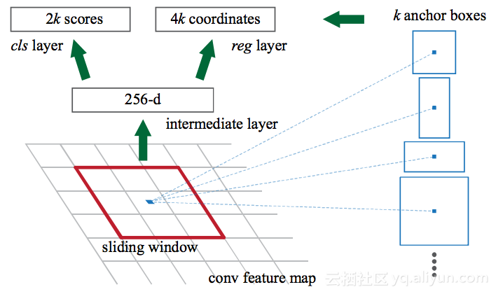

# 目标检测

现有的图像目标检测其通常可以被分为两类：一类是two-stage检测器，最具代表性的是Faster R-CNN[8]。另一种是one-stage检测器，如YOLO、SSD。two-stage检测器具有较高的定位和目标识别精度，而one-stage检测器具有较高的推理速度。two-stage检测器可以按照ROI池化层来划分为two-stage。

## 锚框

预测每个锚框是否含有关注的物体，如果有，基于锚框预测真实的边缘框(偏移)

每一个锚框都是一个训练样本，要么标注为背景，要么关联上一个真实的边缘框（大量的负例样本）

非极大值抑制(NMS)：除去相似的预测框。选非背景类的最大预测值，去掉和他IoU大于某个值的预测

 

## R-CNN

​    RCNN算法不是在大量区域上工作，而是在图像中提出了一堆方框，并检查这些方框中是否包含任何对象。RCNN 使用选择性搜索从图像中提取这些框。

### RCNN检测对象所遵循的步骤

- 首先采用预先训练的卷积神经网络（抽特征）；
- 重新训练该模型模型——根据需要检测的类别数量来训练网络的最后一层（迁移学习）；
- 第三步是获取每个图像的感兴趣区域。然后，对这些区域调整尺寸，以便其可以匹配CNN输入大小；
- 获取区域后，使用SVM算法对对象和背景进行分类。对于每个类，都训练一个二分类SVM；
- 最后，训练线性回归模型，为图像中每个识别出的对象生成更严格的边界框

### RoI Pooling

给定一个锚框，均匀分割成n*m块，输出每块的最大值

不管锚框多大总是输出n*m个值

对不同的锚框都可以变成同一个形状，做batch

## Fast RCNN

每个图像只运行一次CNN，然后找到一种在2,000个区域内共享该计算的方法。在Fast RCNN中，将输入图像馈送到CNN，CNN生成卷积特征映射。使用这些特征图提取候选区域。然后，使用RoI池化层将所有建议的区域重新整形为固定大小，以便将其馈送到全连接网络中。

## Faster RCNN

Faster RCNN是Fast RCNN的修改版本，二者之间的主要区别在于，Fast RCNN使用选择性搜索来生成感兴趣区域，而Faster RCNN使用“区域提议网络”，即RPN。RPN将图像特征映射作为输入，并生成一组提议对象，每个对象提议都以对象分数作为输出。

### RPN

用来代替RCNN中的启发性搜索算法，可以看作一个精度不高的目标检测

RPN使用滑动窗口（也就是3*3卷积），对于每个窗口(feature map 上一个点对应原图的一片区域)生成不同大小形状的k个锚框，对于每个方框，RPN预测两件事：

- 预测锚是对象的概率；
- 用于边界框回归器调整锚点以更好地适合物体的形状；

## Mask RCNN

就是在原始Faster-rcnn算法的基础上面增加了FCN来产生对应的MASK分支。即Faster-rcnn + FCN，更细致的是 RPN + ROIAlign + Fast-rcnn + FCN。

贵，但是效果好

[Face Mask Detection using darknet’s YOLOv3 | by Stefanos Kanellopoulos | Towards Data Science](https://towardsdatascience.com/face-mask-detection-using-darknets-yolov3-84cde488e5a1)

[干货 | 目标检测入门，看这篇就够了（已更完） - 知乎 (zhihu.com)](https://zhuanlan.zhihu.com/p/34142321)

[[1506.02640\] You Only Look Once: Unified, Real-Time Object Detection (arxiv.org)](https://arxiv.org/abs/1506.02640)

[一文读懂「目标检测」经典算法：RCNN,SPP-Net,Fast-RCNN,Faster-RCNN,YOLO,SSD - 简书 (jianshu.com)](https://www.jianshu.com/p/91f2373f7cca)

[【论文解读】Yolo三部曲解读——Yolov3 - 知乎 (zhihu.com)](https://zhuanlan.zhihu.com/p/76802514)

https://pjreddie.com/darknet/yolo/

[Yolo：基於深度學習的物件偵測 (含YoloV3) | Mr. Opengate (mropengate.blogspot.com)](https://mropengate.blogspot.com/2018/06/yolo-yolov3.html)（可以用这里v3的图 这个感觉挺好）

